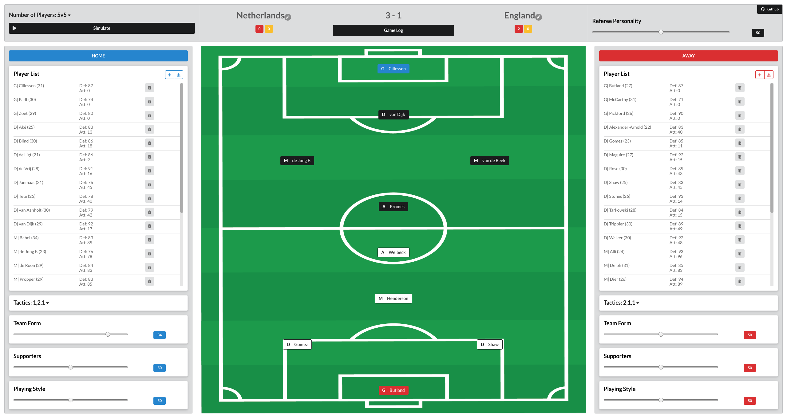
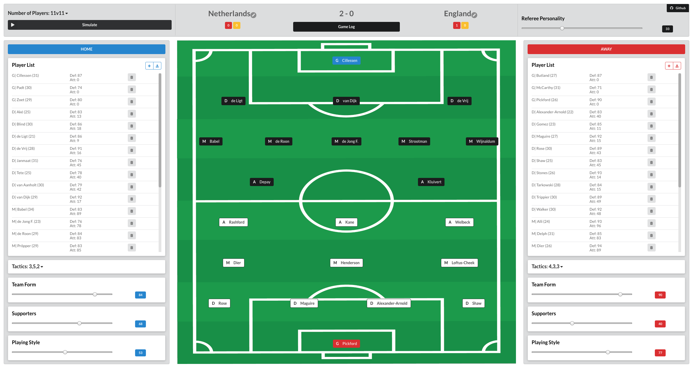
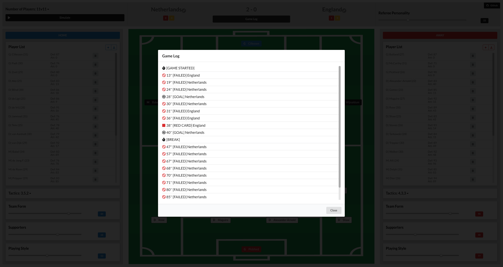

## WWWin - Who Would Win
[](https://app.netlify.com/sites/brave-kare-54d23b/deploys)
[](https://app.fossa.com/projects/git%2Bgithub.com%2Fzediogoviana%2Fwwwin?ref=badge_shield)

**Who Would Win** is a football simulation engine developed in *React*. 

***(only works in desktop browser)***

### [wwwin.netlify.com](https://wwwin.netlify.com/)

Based on my previous *Java* experiment [soccer-simulation-engine](https://github.com/zediogoviana/soccer-simulation-engine),
**WWWin** is an `arcade-like` football (soccer) simulation engine.

Create your team by:
* adding your custom players one by one
* chunk upload from a ```csv``` file 
* generate a random roster and starting lineup.

Every player can later be edited.

## How it Works

Interact with different variables and lineups, observing the impact on the simulation.

It takes account the overall value of the players starting 11, players age, 
the form of the teams, supporters present on the stadium between each teams 
and the team playing style. The referee it is also taken in account, with its personality value.

After all this, luck factors and others are also taken into value in order to simulate a game.

### Player variables

* **Overall value:** Highest values, higher chance of scoring or defending with success.
* **Age:** The older the roster, the more "weak" the players get with game time passing by, reducing the chance of scoring or defending. 

### Team variables definition

* **Team form:** `Integer between 0-100`, being `0` the lowest form possible and `100` the highest.
	* Highest values gives more chances of scoring goals and winning.
* **Supporters:** `Integer between 0-100`, being `0` the lowest supporting from fans possible and `100` the highest. 
	* The team with most supporters has some advantage.
* **Playing Style:** `Integer between 0-100`, being `0`the most defensive possible, and `100` the most attacking.
	* A team with a high attacking playing style has more chance of attacking and scoring, but is more vulnerable on the defense side.

### Number of Players and Tactics definition

It is possible to select the number of players in the game and different formations for each team.

Game Types and Formations:

* **11v11**
    * `4, 3, 3`
    * `3, 5, 2`
    * `4, 4, 2`
* **7v7**
    * `2, 3, 1`
    * `3, 2, 1`
    * `2, 2, 2`
* **5v5**
    * `1, 2, 1`
    * `2, 1, 1`

	
### Referee variables
* **Personality:** `Integer between 0-100`. The higher a personality value of a referee the stricter he is, and higher the chance of giving a red card to a team.
	* A team with sent off players is eavily penalised.


## Roster Upload

### One by One

You just need to fill in the form with the following info:

* Name
* Position
* Attack Value
* Defence Value
* Birth Year

### Chunk upload

In order to run you need to use a `csv` file with the infos of each team's players. 
In `resources` folder there is the corresponding files to test.

The `csv` has the following composition:

* First line (Header)

```
name,position,attack,defense,birthYear
```

* Following lines (Player Information)

```
PlayerName,PlayerPosition,Attack,Defense,PlayerBirthYear
(...) 
```

Where:
* Position: 
    * ```G```: goal-keeper
    * ```D```: defender
    * ```M```: midfielder
    * ```A```: attacker
* Attack and Defense: `Integer between 0-100`
* Birth Year: `YYYY`

[Here](https://github.com/zediogoviana/wwwin/tree/master/resources) you can find two different `csv` examples to try
    
## Screenshots

### 5v5 Game


### 11v11 Game


### Simulation Game Log


## Future work

* Substitutions
* More realistic simulation 
* Injuries
* Yellow cards and Red cards with accumulation
* Maybe implement with [react-redux](https://github.com/reduxjs/react-redux)
